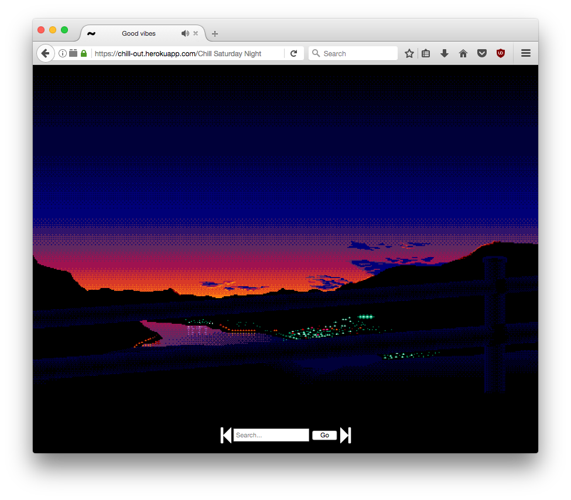

# <p align="center"></img></p>

### Relaxing music loops from /f/

This project houses a selection of flash videos with atmospheric music and images.
Flash is no longer a popular media format, but I think that in this case it adds a lo-fi charm.
Minimal navigation controls are provided to switch between songs.

This server is hosted @ http://goodvibes.mozz.us/



## Setup
To run your own server using gunicorn

```bash
$ git clone https://github.com/michael-lazar/goodvibes
$ cd goodvibes
$ python3 -m virtualenv venv
$ source venv/bin/activate
$ pip install -r requirements.txt
$ cp server.cfg.example server.cfg
$ gunicorn goodvibes.server:app
```

## Shortcuts
- <kbd>◄</kbd>: Previous video
- <kbd>►</kbd>: Next video
- <kbd>SPACE</kbd>: Random video
